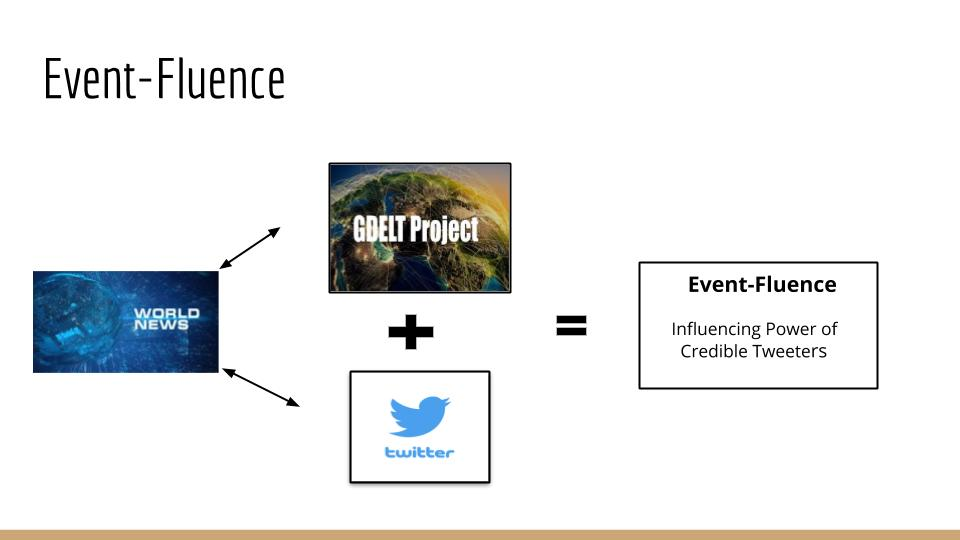
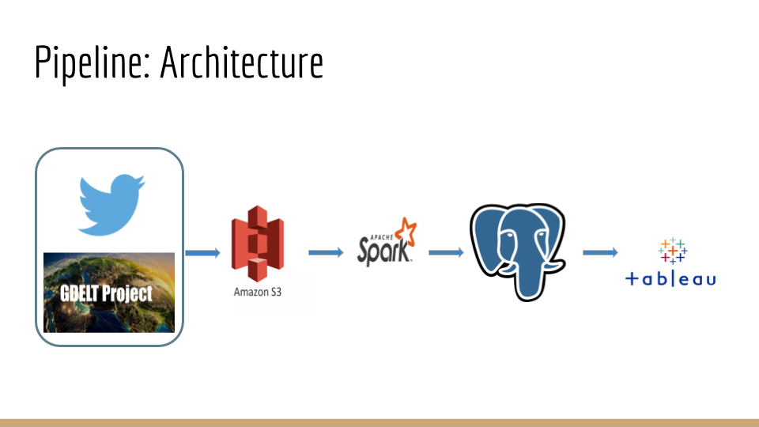

# Insight-Project
# Event-Fluence: Influencing power of credible tweeters

Lot of events are happening around the world.
GDELT is an open source project called GDELT Project that collates articles from broadcast, print, and web news from  around the world and identifies the themes, sources, locations, event types among others.
In this project, we combine GDELT data with Twitter data, to get information about twitter influencer network.

## Installation

Use `runSpark.sh` to run the spark jobs for GDELT and twitter datasets. The project runs on a distributed cluster on Spark.
The input files are stores on AWS S3 buckets
Postgresql is the final database
The script requires Spark running on a distributed cluster, input .csv data files stored in an S3 bucket, and a PostgreSQL database to store the output tables.
The frontend application is developed using Tableau.

## Architecture

We load the data from GDELT and Twitter to Amazon s3
Prepare, process the data and load it to postgresql
Finally, visualize results using tableau

## Datasets
*Twitter 
Source: [INTERNET ARCHIVE](https://archive.org/details/archiveteam-twitter-stream-2020-03)
1 month of uncompressed data ⩬ 840 GB
*GDELT 
Source: [GDELT project](https://www.gdeltproject.org/data.html#rawdatafiles)
1 months  ⩬ 18 GB

## Challenges
Challenges in developing the app included: 
* Huge volume
* Slow queries

## License
Copyright 2020 Chaithra Lakshmi Sathyanarayana

Licensed under the Apache License, Version 2.0 (the "License");
you may not use this file except in compliance with the License.
You may obtain a copy of the License at:

[http://www.apache.org/licenses/LICENSE-2.0](http://www.apache.org/licenses/LICENSE-2.0)

Unless required by applicable law or agreed to in writing, software
distributed under the License is distributed on an "AS IS" BASIS,
WITHOUT WARRANTIES OR CONDITIONS OF ANY KIND, either express or implied.
See the License for the specific language governing permissions and
limitations under the License.
